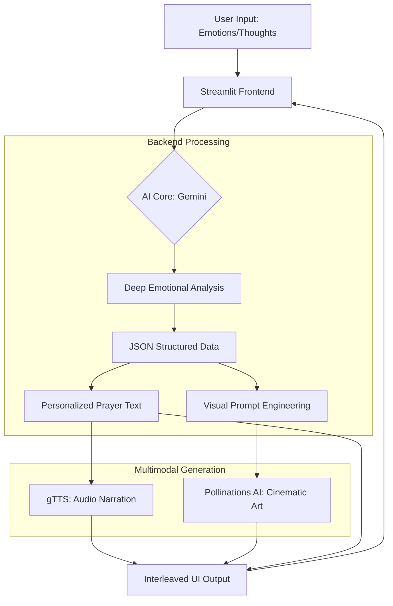

# 🕊️ AI Prayer App (Multimodal Spiritual Companion)

**AI Prayer App** is a next-generation spiritual sanctuary designed for the **Gemini Live Agent Challenge**. It leverages the power of multimodal AI to transform human emotions into personalized prayers, comforting audio narration, and serene AI-generated art.

---

## ✨ Features

*   **Deep Emotional Analysis:** Uses **Gemini 2.5 Pro** to analyze the user's input, extracting intent, emotional layers, and spiritual needs.
*   **Multimodal Interleaved Output:** 
    *   **Text:** Personalized, spiritually grounding prayers tailored to the user's specific context.
    *   **Audio:** Real-time text-to-speech (TTS) narration using `gTTS` for an immersive listening experience.
    *   **Visuals:** Dynamic, cinematic nature landscape generation using **Pollinations AI** (Flux model) that mirrors the prayer's emotional tone.
*   **Bi-lingual Support:** Fully localized in both **Turkish** and **English**.
*   **Deep Night UI:** A custom-crafted, serene CSS interface designed for peaceful reflection.

---

## 🏛️ System Architecture

The following diagram illustrates the multimodal pipeline and how our AI core (Gemini/Ollama) orchestrates the spiritual experience:



---

## 🛠️ Technology Stack

*   **Brain:** [Google Gemini API](https://ai.google.dev/) (Gemini 2.5 Pro & 2.0 Flash)
*   **SDK:** `google-genai` Python SDK
*   **Frontend:** [Streamlit](https://streamlit.io/)
*   **Image Generation:** [Pollinations AI](https://pollinations.ai/) (Flux Model)
*   **Audio Generation:** `gTTS` (Google Text-to-Speech)
*   **Cloud:** [Google Cloud Platform (GCP)](https://cloud.google.com/)
*   **Hosting:** [Google Cloud Run](https://cloud.google.com/run) (via Docker)

---

## 🚀 Getting Started

### Prerequisites

*   Python 3.9+
*   A Google Gemini API Key ([Get one here](https://aistudio.google.com/app/apikey))

### Installation

1.  **Clone the repository:**
    ```bash
    git clone https://github.com/your-username/prayer-app.git
    cd prayer-app
    ```

2.  **Install dependencies:**
    ```bash
    pip install -r requirements.txt
    ```

3.  **Set your API Key:**
    ```bash
    export GEMINI_API_KEY="your-api-key-here"
    ```

4.  **Run the application:**
    ```bash
    streamlit run app.py
    ```

---

## ☁️ Deployment (Google Cloud Run)

This project is containerized for easy deployment to Google Cloud Run.

1.  **Build and Deploy:**
    ```bash
    gcloud run deploy prayer-app --source . --region us-central1 --allow-unauthenticated --set-env-vars="GEMINI_API_KEY=your-api-key"
    ```

For detailed instructions, see [deployment_instructions.md](./deployment_instructions.md).

---

## 🛡️ Proof of Google Cloud Usage

This project demonstrates the use of Google Cloud services as per the Gemini Live Agent Challenge requirements:

1.  **Google Gemini API (Vertex AI/GenAI):** The core reasoning is powered by **Gemini 2.5 Pro**. You can find the direct API implementation using the official `google-genai` SDK in:
    *   [app.py:L211 (Client Init)](https://github.com/BetulTerzioglu/prayer-app/blob/main/app.py#L211)
    *   [app.py:L218 (Structured Data Extraction)](https://github.com/BetulTerzioglu/prayer-app/blob/main/app.py#L218)
    *   [app.py:L240 (Personalized Storytelling Generation)](https://github.com/BetulTerzioglu/prayer-app/blob/main/app.py#L240)
2.  **Google Cloud Run:** The application is containerized and ready for deployment on GCP Cloud Run. (See [Dockerfile](./Dockerfile))

---

## 🧠 Project Story

This project was built for the **Gemini Live Agent Challenge** (Creative Storyteller Category). Our goal was to push the boundaries of interleaved multimodal outputs, creating an experience where text, sight, and sound work in harmony to provide emotional support.

Read the full story in [metin.md](./metin.md).

---

## 📜 License

Created as part of the Gemini Live Agent Challenge 2026. 🕊️
